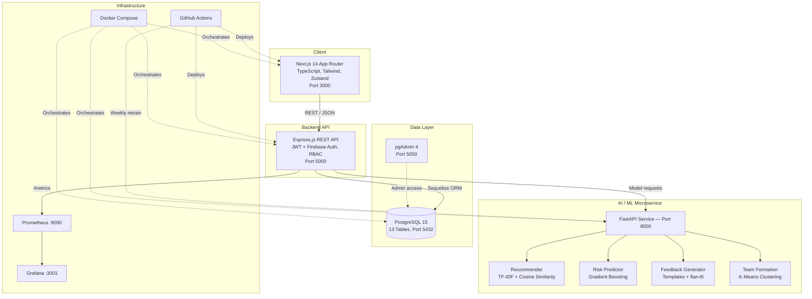
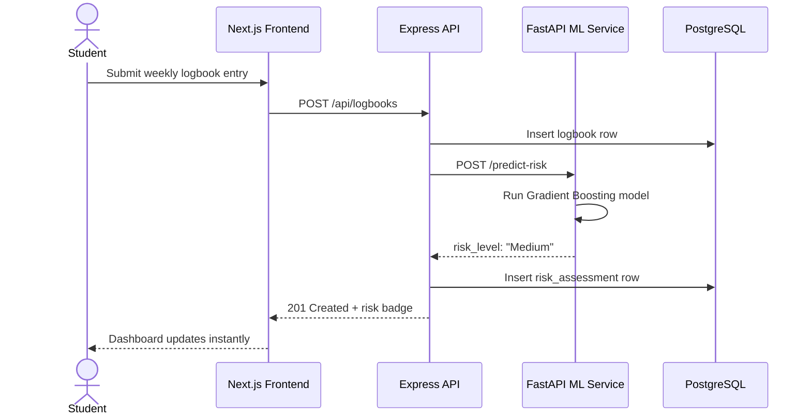
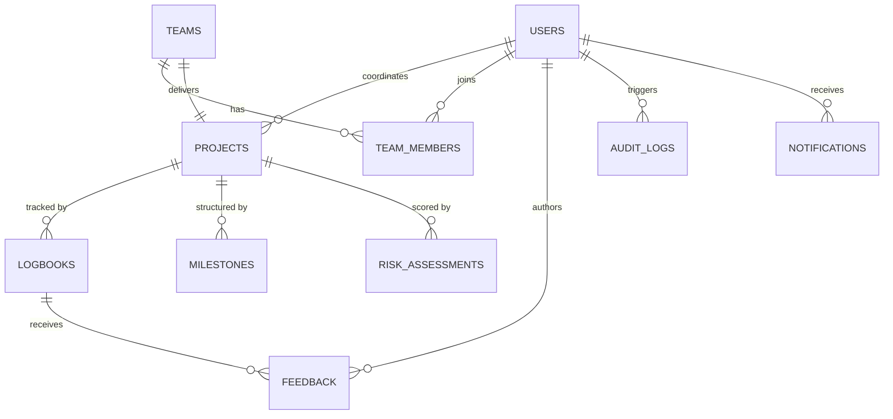
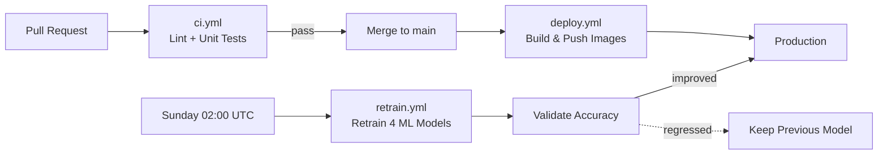

<div align="center">

# ⚡ CapstoneX

### AI-Powered Academic Project Governance & Intelligence Platform

**A production-grade, microservices platform that uses machine learning to run a university's capstone program end-to-end — AI project matching, automated risk detection, smart team formation, and role-based governance for every stakeholder.**

[](https://www.capstonex.me)
[](https://github.com/kunalkhaire302/CapstoneX-Powered-Academic-Project-Governance-and-Intelligence-Platform)
[](#-license)


**[🚀 Live Demo](https://www.capstonex.me) · [📂 Repository](https://github.com/kunalkhaire302/CapstoneX-Powered-Academic-Project-Governance-and-Intelligence-Platform) · [🧠 AI Modules](#-ai-intelligence-modules) · [🏗 Architecture](#-system-architecture) · [🚀 Quick Start](#-getting-started)**

</div>

---

## 👋 For Recruiters & Reviewers

> **TL;DR** — CapstoneX is a full-stack, **four-service** platform (Next.js · Express · FastAPI · PostgreSQL) with **four real, trained ML models** running live — not notebook demos. It ships with role-based access control, CI/CD with scheduled model retraining, Prometheus/Grafana monitoring, and k6 load testing. Every claim below is verifiable directly in the codebase.

| | |
|---|---|
| 🔗 **Live product** | **[www.capstonex.me](https://www.capstonex.me)** |
| 💻 **Source code** | **[GitHub Repository](https://github.com/kunalkhaire302/CapstoneX-Powered-Academic-Project-Governance-and-Intelligence-Platform)** |
| 🔑 **Try it live** | Log in with any account in the [User Roles](#-user-roles--access-control) table below |
| 🧑‍💻 **Author** | [Kunal Khaire](https://github.com/kunalkhaire302) |

---

## 📑 Table of Contents

- [Overview](#-overview)
- [Key Highlights](#-key-highlights)
- [At a Glance](#-at-a-glance)
- [Screenshots](#-screenshots)
- [System Architecture](#-system-architecture)
- [Request Flow](#-request-flow)
- [AI Intelligence Modules](#-ai-intelligence-modules)
- [Tech Stack](#-tech-stack)
- [Database Design](#-database-design)
- [User Roles & Access Control](#-user-roles--access-control)
- [Folder Structure](#-folder-structure)
- [Getting Started](#-getting-started)
- [API Reference](#-api-reference)
- [CI/CD Pipeline](#-cicd-pipeline)
- [Testing](#-testing)
- [Monitoring & Observability](#-monitoring--observability)
- [Roadmap](#-roadmap)
- [Contributing](#-contributing)
- [License](#-license)
- [Author](#-author)

---

## 🎯 Overview

Running a university capstone program the traditional way breaks down at scale:

- Students don't know which project to pick, and often choose one they're not suited for.
- Mentors rewrite the same feedback by hand for every single logbook.
- Coordinators have no early-warning system for a struggling team — by the time it's obvious, it's too late.
- HODs have no visibility across departments until final review.

**CapstoneX replaces all of this with one governed platform** — a multi-service web application with a dedicated Python ML microservice doing the heavy lifting:

| Problem | How CapstoneX Solves It |
|---|---|
| Students pick the wrong project | AI recommends projects using **TF-IDF + cosine similarity** against student interests |
| Struggling teams go unnoticed | A **Gradient Boosting classifier** scores every project Low / Medium / High risk |
| Mentors burn hours on repetitive feedback | An **AI feedback generator** drafts structured, context-aware comments automatically |
| Manually formed teams are unbalanced | **K-Means clustering** groups students into skill-diverse, balanced teams |

Access is governed by a **6-role RBAC system** (Admin, HOD, Coordinator, Mentor, Examiner, Student), so every stakeholder sees exactly what they need — and nothing they don't.

**[⬆ back to top](#-capstonex)**

---

## ✨ Key Highlights

What pushes this past a typical academic CRUD project:

- 🧠 **Four real ML models in production** — trained scikit-learn models served through a live FastAPI microservice with its own auto-generated Swagger docs.
- 🏗️ **True microservices** — four independently deployable services (frontend, backend, AI service, database), each with its own runtime, port, and single responsibility.
- 🔐 **Enterprise-style auth** — dual-layer JWT + Firebase Authentication with 6-tier RBAC enforced at the middleware level, not just hidden in the UI.
- ⚙️ **CI/CD that does real work** — GitHub Actions lints, tests, and deploys on every merge, *and* retrains all four ML models automatically every week.
- 📊 **Actual observability** — Prometheus scrapes live metrics into Grafana dashboards, plus Firebase Analytics on the frontend.
- 🧪 **Load-tested, not just unit-tested** — k6 scripts simulate concurrent, university-scale traffic against the most critical endpoints.
- ♿ **Accessibility checked in CI** — `eslint-plugin-jsx-a11y` and Lighthouse CI catch accessibility regressions before they ship.
- 🐳 **One-command local setup** — `docker-compose up --build` boots all four services together.

**[⬆ back to top](#-capstonex)**

---

## 📈 At a Glance

| | |
|---|---|
| 🏗️ **Architecture** | Microservices — 4 independently deployable services |
| 🧠 **ML Models** | 4 in production — recommender, risk predictor, feedback generator, team former |
| 🗄️ **Database** | PostgreSQL 15 · 13 tables · UUID keys · JSONB metadata |
| 🔐 **Access Control** | 6-tier RBAC enforced at the middleware layer |
| 🧪 **Test Coverage** | Jest (backend) · pytest (AI service) · k6 (load testing) |
| ⚙️ **CI/CD** | 3 automated GitHub Actions pipelines, including weekly model retraining |
| 💻 **Languages** | TypeScript 51% · JavaScript 25% · Python 21% · CSS 2% |

**[⬆ back to top](#-capstonex)**

---

## 📸 Screenshots

> Add real screenshots or a short GIF walkthrough of the live app here — it's one of the first things a recruiter looks at. Suggested shots: **login screen**, **student dashboard with AI recommendations**, **risk prediction view**, **mentor feedback screen**, **admin/HOD analytics view**.

```markdown


```

Save the images inside a `docs/screenshots/` folder in the repo and reference them with relative paths as above — they'll render directly on this page.

**[⬆ back to top](#-capstonex)**

---

## 🏗 System Architecture

CapstoneX runs as **four independent services** that talk to each other over HTTP/REST, orchestrated locally with Docker Compose and deployed through GitHub Actions.



**How it fits together:**

1. The **frontend** (Next.js 14, App Router) owns all UI, client state (Zustand), and server-side rendering.
2. The **backend** (Express.js) is the central hub — authentication, RBAC enforcement, business logic, and proxying AI requests.
3. The **AI service** (FastAPI) is fully decoupled — it only knows about ML, exposes its own REST endpoints, and has its own interactive docs at `/docs`.
4. **PostgreSQL** is the single source of truth, with UUID primary keys and JSONB columns for flexible metadata.
5. **Prometheus + Grafana** watch the backend in real time; **GitHub Actions** builds, tests, deploys, and retrains models on a schedule.

**[⬆ back to top](#-capstonex)**

---

## 🔄 Request Flow

A concrete example of the services talking to each other — what happens when a student submits a weekly logbook entry:



**[⬆ back to top](#-capstonex)**

---

## 🧠 AI Intelligence Modules

The most technically interesting part of the project — a standalone FastAPI microservice exposing four ML-powered endpoints.

### 1. 📌 Project Recommendation Engine

Converts project descriptions into TF-IDF vectors, then ranks projects for a student by cosine similarity against their stated interests.

```python
# simplified flow
tfidf_matrix = vectorizer.fit_transform(project_descriptions)
student_vector = vectorizer.transform([student_interests])
scores = cosine_similarity(student_vector, tfidf_matrix)
top_5 = scores.argsort()[0][-5:][::-1]
```

**Why TF-IDF?** It's fast, interpretable, needs no GPU, and works well on short domain-specific text like project titles — a better fit here than a heavier embedding model.

### 2. ⚠️ Project Risk Prediction

A **Gradient Boosting classifier**, trained on historical project data, scores every active project **Low / Medium / High** risk.

```python
features = [
    "logbook_entries_count",
    "days_since_last_submission",
    "milestone_completion_rate",
    "mentor_feedback_count",
    "team_activity_score",
]
model = GradientBoostingClassifier(n_estimators=100, max_depth=4)
risk_label = model.predict([project_features])  # "Low" | "Medium" | "High"
```

**Why Gradient Boosting?** It captures non-linear interactions between features that logistic regression misses, and resists overfitting on tabular academic data better than a single decision tree.

### 3. 💬 AI Feedback Generator

Combines a template-based engine with an optional **flan-t5** transformer to turn logbook and milestone data into structured, natural-language mentor feedback — triggered automatically at each review cycle.

### 4. 👥 Smart Team Formation

**K-Means clustering** groups students by a skill vector (languages known, domain interests, past grades, availability); a diversity-balancing pass then ensures no team is dominated by a single skill set.

```python
skill_matrix = vectorize_skills(all_students)
kmeans = KMeans(n_clusters=num_teams, random_state=42)
labels = kmeans.fit_predict(skill_matrix)
balanced_teams = apply_diversity_balance(labels, all_students)
```

### 🔁 Weekly Automated Retraining

A scheduled `retrain.yml` GitHub Actions workflow retrains all four models **every Sunday at 02:00 UTC** against the latest project data, validates accuracy, and only promotes the new model if it performs at least as well as the one already in production.

**[⬆ back to top](#-capstonex)**

---

## 🛠 Tech Stack

### Frontend — Next.js 14 + TypeScript

| Technology | Purpose |
|---|---|
| **Next.js 14** (App Router) | Full-stack React framework — SSR, SSG, and API routes |
| **TypeScript** | Type safety across the majority of the codebase |
| **Tailwind CSS** | Utility-first, responsive styling |
| **Zustand** | Lightweight global state management |
| **TanStack React Query** | Server-state caching and background refetching |
| **Recharts** | Analytics dashboards and progress charts |
| **Framer Motion** | Page and component animation |

### Backend — Express.js + Node.js

| Technology | Purpose |
|---|---|
| **Express.js** | REST API server and business logic layer |
| **JWT + Firebase Auth** | Dual-layer authentication — stateless tokens plus Firebase identity |
| **Sequelize ORM** | Type-safe database access with migrations and seeders |
| **RBAC middleware** | 6-role access control enforced on every route |
| **Rate limiting** | Protects endpoints from abuse and brute-force attempts |
| **Audit logging** | Records every sensitive action for compliance |

### AI Service — FastAPI + Python

| Technology | Purpose |
|---|---|
| **FastAPI** | Async Python REST API with auto-generated Swagger docs |
| **scikit-learn** | Gradient Boosting, TF-IDF, and K-Means models |
| **flan-t5** *(optional)* | Transformer model for natural-language feedback |
| **pytest** | Automated testing for every ML endpoint |

### Database & DevOps

| Technology | Purpose |
|---|---|
| **PostgreSQL 15** | Primary relational data store |
| **Docker Compose** | One-command orchestration of all four services |
| **GitHub Actions** | CI/CD — lint, test, deploy, and weekly model retraining |
| **Prometheus + Grafana** | Real-time API metrics and dashboards |
| **k6** | Load testing under simulated concurrent traffic |
| **Firebase Analytics** | Frontend event tracking |

**[⬆ back to top](#-capstonex)**

---

## 🗄 Database Design

PostgreSQL 15, **13 tables**, UUID primary keys, and JSONB columns for flexible metadata. Below is a simplified relationship view of the core entities (a few smaller supporting tables are omitted for clarity):



**Design decisions:**
- **UUID primary keys** — distributed-safe and non-enumerable, unlike auto-increment IDs.
- **JSONB metadata columns** — flexible fields without constant schema migrations.
- **Indexed foreign keys** — fast joins across projects, teams, and logbooks.
- **Sequelize migrations + seeders** — version-controlled schema and an instant demo dataset.

**[⬆ back to top](#-capstonex)**

---

## 👥 User Roles & Access Control

CapstoneX enforces **6-role RBAC** at the API middleware layer — every request is checked against the caller's role before it reaches business logic.

| Role | Demo Email | Password | Key Permissions |
|---|---|---|---|
| 👑 **Admin** | admin@capstonex.com |  | Full system access, user management, configuration |
| 🧑‍🏫 **Mentor** | mentor1@capstonex.com | `CapstoneX@2024` | Review logbooks, write feedback, track progress |
| 🎓 **Student** | student1@capstonex.com | `CapstoneX@2024` | Submit logbooks, view projects, collaborate |

> Head to **[capstonex.me](https://www.capstonex.me)** and log in with any account above to explore the live platform from that role's perspective.

**[⬆ back to top](#-capstonex)**

---

## 📁 Folder Structure

```
CapstoneX/
│
├── frontend/                   # Next.js 14 application
│   ├── app/                    # App Router pages & layouts
│   ├── components/             # Reusable UI components
│   ├── lib/                    # Utilities, API clients, firebase.ts
│   ├── store/                  # Zustand global state
│   └── hooks/                  # Custom React Query hooks
│
├── backend/                    # Express.js REST API
│   ├── src/
│   │   ├── controllers/        # Route handler logic
│   │   ├── middleware/         # Auth, RBAC, rate-limit, audit
│   │   ├── models/             # Sequelize models (13 tables)
│   │   ├── routes/             # API route definitions
│   │   └── services/           # Business logic layer
│   ├── migrations/             # Database migrations
│   └── seeders/                # Demo data seeds
│
├── ai-service/                 # FastAPI Python ML service
│   ├── app/
│   │   ├── routers/            # Endpoint definitions
│   │   ├── models/             # ML model loading & inference
│   │   └── schemas/            # Pydantic request/response schemas
│   └── tests/                  # pytest suite
│
├── docs/                       # Architecture & API documentation
├── .github/workflows/          # CI/CD pipelines (ci, deploy, retrain)
├── docker-compose.yml          # Full local environment
├── k6-load-test.js             # API load testing scripts
├── architecture_extensions.md  # Monitoring & i18n extension plans
└── .env.example                # Required environment variables
```

**[⬆ back to top](#-capstonex)**

---

## 🚀 Getting Started

### Prerequisites

- **Node.js 20+** — `node --version`
- **Python 3.11+** — `python --version`
- **Docker & Docker Compose** — `docker --version`
- **PostgreSQL 15+** — only if setting up manually without Docker

### Option 1 — Docker Compose (recommended)

One command brings up all four services.

```bash
# 1. Clone the repository
git clone https://github.com/kunalkhaire302/CapstoneX-Powered-Academic-Project-Governance-and-Intelligence-Platform.git
cd CapstoneX-Powered-Academic-Project-Governance-and-Intelligence-Platform

# 2. Configure environment variables
cp .env.example .env
# open .env and fill in your PostgreSQL, JWT, and Firebase values

# 3. Build and start everything
docker-compose up --build

# 4. In a new terminal, run migrations and seed demo data
docker exec capstonex-backend npm run db:reset
```

| Service | URL |
|---|---|
| Frontend | http://localhost:3000 |
| Backend health check | http://localhost:5000/api/health |
| AI service docs (Swagger) | http://localhost:8000/docs |
| pgAdmin | http://localhost:5050 |

### Option 2 — Manual setup (service by service)

```bash
# Backend
cd backend
npm install
cp ../.env.example .env      # fill in your values
npm run migrate              # creates all 13 tables
npm run seed                 # loads demo users and projects
npm run dev                  # http://localhost:5000

# Frontend
cd frontend
npm install
npm run dev                  # http://localhost:3000

# AI Service
cd ai-service
python -m venv venv
source venv/bin/activate     # Windows: venv\Scripts\activate
pip install -r requirements.txt
python -m app.main           # http://localhost:8000
```

**[⬆ back to top](#-capstonex)**

---

## 🔌 API Reference

Backend base URL: `http://localhost:5000/api` · AI service Swagger UI: `http://localhost:8000/docs`

### Auth

| Method | Endpoint | Description |
|---|---|---|
| POST | `/api/auth/login` | Authenticate and return a JWT |
| POST | `/api/auth/register` | Register a new user |
| POST | `/api/auth/refresh` | Refresh an expired token |

### Projects

| Method | Endpoint | Description | Access |
|---|---|---|---|
| GET | `/api/projects` | List projects (paginated, filterable) | All roles |
| POST | `/api/projects` | Create a project | Coordinator, Admin |
| GET | `/api/projects/:id` | Get project details | All roles |
| PUT | `/api/projects/:id` | Update project metadata | Coordinator, Admin |
| DELETE | `/api/projects/:id` | Remove a project | Admin |

### Logbooks & Teams

| Method | Endpoint | Description |
|---|---|---|
| POST | `/api/logbooks` | Submit a weekly logbook entry |
| GET | `/api/logbooks/:projectId` | View all entries for a project |
| PUT | `/api/logbooks/:id/feedback` | Mentor adds feedback to an entry |
| POST | `/api/teams/auto-form` | Trigger AI team formation |
| GET | `/api/teams/:id` | Get team members and activity |
| PATCH | `/api/teams/:id/members` | Manually adjust a team's composition |

### AI Proxy (backend → AI service)

| Method | Endpoint | Description |
|---|---|---|
| POST | `/api/ai/recommend` | Get project recommendations for a student |
| POST | `/api/ai/risk` | Predict a project's risk level |
| GET | `/api/ai/feedback/:logbookId` | Generate AI feedback for a logbook |

### AI Service (FastAPI, port 8000)

| Method | Endpoint | Request | Response |
|---|---|---|---|
| POST | `/recommend` | `student_id`, `interests` | Ranked project list |
| POST | `/predict-risk` | `project_features` | `"Low"` \| `"Medium"` \| `"High"` |
| POST | `/feedback` | `logbook_text`, `context` | Generated feedback string |
| POST | `/form-teams` | `students[]`, `n_teams` | Balanced team assignments |
| GET | `/health` | — | Service health check |
| GET | `/docs` | — | Interactive Swagger UI |

**[⬆ back to top](#-capstonex)**

---

## ⚙ CI/CD Pipeline

Three GitHub Actions workflows automate the entire delivery process.



| Workflow | Trigger | What it does |
|---|---|---|
| `ci.yml` | Every pull request | Lints frontend (ESLint) and backend, runs Jest and pytest suites, blocks merge on failure |
| `deploy.yml` | Merge to `main` | Builds Docker images, pushes to the registry, deploys updated containers |
| `retrain.yml` | Every Sunday, 02:00 UTC | Pulls latest project data, retrains all four ML models, validates accuracy before promoting |

**[⬆ back to top](#-capstonex)**

---

## 🧪 Testing

```bash
# Backend unit + integration tests (Jest)
cd backend && npm test
cd backend && npm run test:coverage

# AI service tests (pytest)
cd ai-service && pytest tests/ -v

# Frontend component tests
cd frontend && npm test

# Load test (requires k6 installed)
k6 run k6-load-test.js
```

**[⬆ back to top](#-capstonex)**

---

## 📊 Monitoring & Observability

- **Prometheus + Grafana** — `express-prometheus-bundle` exposes HTTP request rate, latency, and error rate per route; Grafana visualizes it in real time.

  ```bash
  docker-compose -f docker-compose.yml -f docker-compose.monitoring.yml up
  # Prometheus → http://localhost:9090
  # Grafana    → http://localhost:3001
  ```

- **Firebase Analytics** — tracks frontend product events, e.g. `logEvent(analytics, 'logbook_submitted', { project_id, student_id })`.
- **Accessibility (WCAG 2.1 AA)** — `eslint-plugin-jsx-a11y` runs in CI, and Lighthouse CI scores every pull request automatically.
- **Load testing (k6)** — `k6-load-test.js` simulates concurrent users hitting the most critical endpoints to verify the system holds up under university-scale traffic.

**[⬆ back to top](#-capstonex)**

---

## 🗺 Roadmap

- [x] Core RBAC with 6 roles
- [x] TF-IDF project recommendation engine
- [x] Gradient Boosting risk prediction
- [x] K-Means team formation
- [x] AI feedback generation with flan-t5
- [x] Docker Compose full-stack setup
- [x] GitHub Actions CI/CD + weekly ML retraining
- [x] Prometheus + Grafana monitoring scaffold
- [ ] Real-time notifications (WebSockets)
- [ ] Internationalization — Hindi, Marathi via `next-intl`
- [ ] Mobile app (React Native)
- [ ] LLM upgrade — Llama 3 / GPT-4o for feedback generation
- [ ] Plagiarism detection module

**[⬆ back to top](#-capstonex)**

---

## 🤝 Contributing

1. Fork the repository
2. Create a feature branch: `git checkout -b feature/your-feature-name`
3. Commit using [Conventional Commits](https://www.conventionalcommits.org/): `git commit -m "feat: add your feature"`
4. Push the branch: `git push origin feature/your-feature-name`
5. Open a Pull Request — CI checks run automatically

---

## 📄 License

Licensed under the **MIT License**. See [LICENSE](LICENSE) for details.

---

## 👤 Author

**Kunal Khaire**

[](https://github.com/kunalkhaire302)

> Add your LinkedIn, portfolio, and email here so recruiters can reach you directly, for example:
> `[)]([https://linkedin.com/in/your-handle](https://www.linkedin.com/in/kunal-khaire/))`

<div align="center">

**⭐ If this project helped you, consider giving it a star — it genuinely helps.**

Built with a lot of ☕ and a healthy respect for deadline pressure.

</div>
