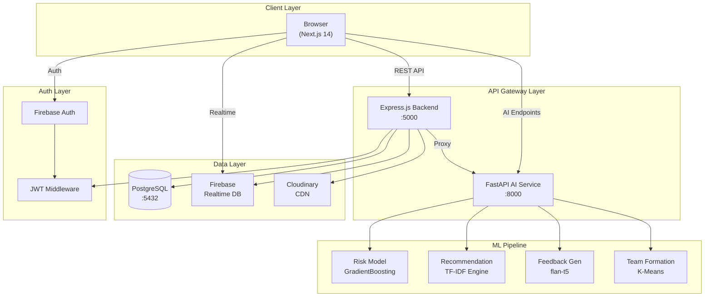
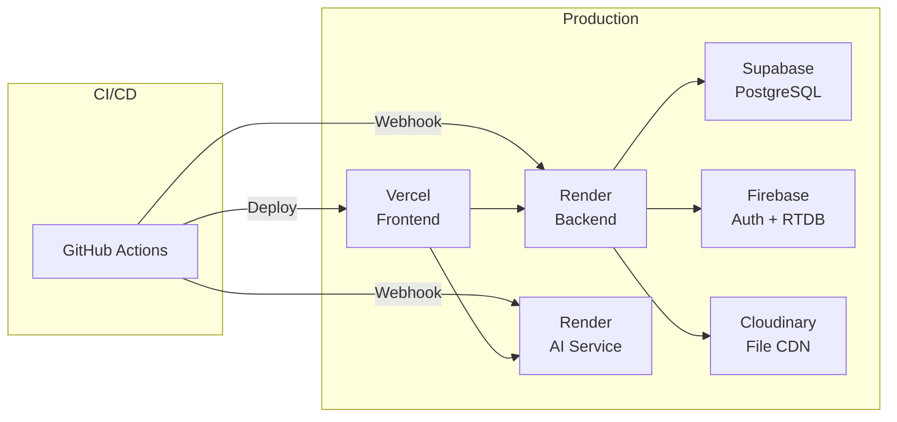
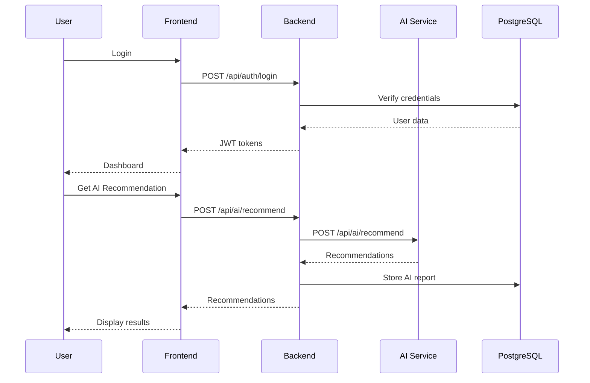

# CapstoneX — System Architecture

## High-Level Architecture

```mermaid
graph TB
    subgraph "Client Layer"
        A["Browser<br/>(Next.js 14)"]
    end

    subgraph "API Gateway Layer"
        B["Express.js Backend<br/>:5000"]
        C["FastAPI AI Service<br/>:8000"]
    end

    subgraph "Data Layer"
        D[("PostgreSQL<br/>:5432")]
        E["Firebase<br/>Realtime DB"]
        F["Cloudinary<br/>CDN"]
    end

    subgraph "Auth Layer"
        G["Firebase Auth"]
        H["JWT Middleware"]
    end

    subgraph "ML Pipeline"
        I["Risk Model<br/>GradientBoosting"]
        J["Recommendation<br/>TF-IDF Engine"]
        K["Feedback Gen<br/>flan-t5"]
        L["Team Formation<br/>K-Means"]
    end

    A -->|REST API| B
    A -->|AI Endpoints| C
    A -->|Realtime| E
    A -->|Auth| G

    B --> D
    B --> E
    B --> F
    B --> H
    B -->|Proxy| C

    G --> H

    C --> I
    C --> J
    C --> K
    C --> L
```

## Deployment Architecture

```mermaid
graph LR
    subgraph "CI/CD"
        GA["GitHub Actions"]
    end

    subgraph "Production"
        V["Vercel<br/>Frontend"]
        R1["Render<br/>Backend"]
        R2["Render<br/>AI Service"]
        S["Supabase<br/>PostgreSQL"]
        FB["Firebase<br/>Auth + RTDB"]
        CL["Cloudinary<br/>File CDN"]
    end

    GA -->|Deploy| V
    GA -->|Webhook| R1
    GA -->|Webhook| R2
    R1 --> S
    R1 --> FB
    R1 --> CL
    V --> R1
    V --> R2
```

## Request Flow

```mermaid
sequenceDiagram
    participant U as User
    participant F as Frontend
    participant B as Backend
    participant AI as AI Service
    participant DB as PostgreSQL

    U->>F: Login
    F->>B: POST /api/auth/login
    B->>DB: Verify credentials
    DB-->>B: User data
    B-->>F: JWT tokens
    F-->>U: Dashboard

    U->>F: Get AI Recommendation
    F->>B: POST /api/ai/recommend
    B->>AI: POST /api/ai/recommend
    AI-->>B: Recommendations
    B->>DB: Store AI report
    B-->>F: Recommendations
    F-->>U: Display results
```
