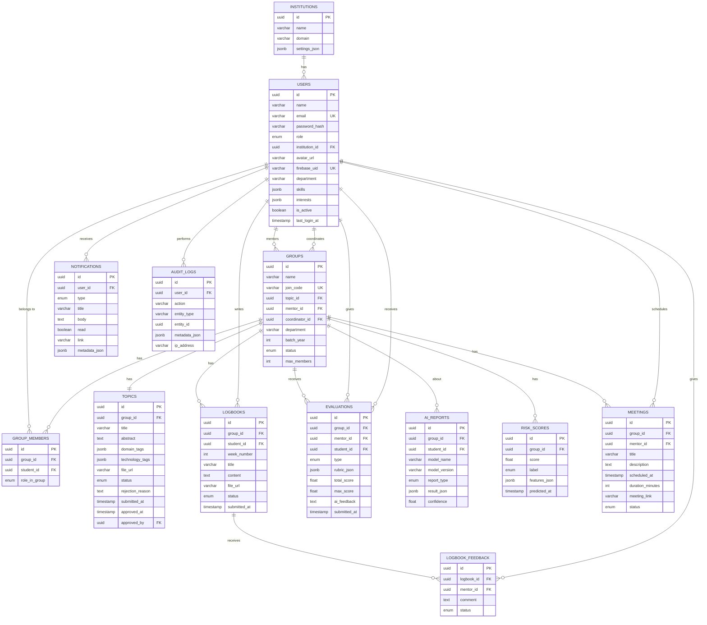

# CapstoneX — ER Diagram

## Entity Relationship Diagram

```mermaid
erDiagram
    INSTITUTIONS ||--o{ USERS : "has"
    USERS ||--o{ GROUPS : "mentors"
    USERS ||--o{ GROUPS : "coordinates"
    USERS ||--o{ GROUP_MEMBERS : "belongs to"
    GROUPS ||--o{ GROUP_MEMBERS : "has"
    GROUPS ||--|| TOPICS : "has"
    GROUPS ||--o{ LOGBOOKS : "has"
    USERS ||--o{ LOGBOOKS : "writes"
    LOGBOOKS ||--o{ LOGBOOK_FEEDBACK : "receives"
    USERS ||--o{ LOGBOOK_FEEDBACK : "gives"
    GROUPS ||--o{ EVALUATIONS : "receives"
    USERS ||--o{ EVALUATIONS : "gives"
    USERS ||--o{ EVALUATIONS : "receives"
    USERS ||--o{ NOTIFICATIONS : "receives"
    USERS ||--o{ AUDIT_LOGS : "performs"
    GROUPS ||--o{ AI_REPORTS : "about"
    GROUPS ||--o{ RISK_SCORES : "has"
    GROUPS ||--o{ MEETINGS : "has"
    USERS ||--o{ MEETINGS : "schedules"

    INSTITUTIONS {
        uuid id PK
        varchar name
        varchar domain
        jsonb settings_json
    }

    USERS {
        uuid id PK
        varchar name
        varchar email UK
        varchar password_hash
        enum role
        uuid institution_id FK
        varchar avatar_url
        varchar firebase_uid UK
        varchar department
        jsonb skills
        jsonb interests
        boolean is_active
        timestamp last_login_at
    }

    GROUPS {
        uuid id PK
        varchar name
        varchar join_code UK
        uuid topic_id FK
        uuid mentor_id FK
        uuid coordinator_id FK
        varchar department
        int batch_year
        enum status
        int max_members
    }

    GROUP_MEMBERS {
        uuid id PK
        uuid group_id FK
        uuid student_id FK
        enum role_in_group
    }

    TOPICS {
        uuid id PK
        uuid group_id FK
        varchar title
        text abstract
        jsonb domain_tags
        jsonb technology_tags
        varchar file_url
        enum status
        text rejection_reason
        timestamp submitted_at
        timestamp approved_at
        uuid approved_by FK
    }

    LOGBOOKS {
        uuid id PK
        uuid group_id FK
        uuid student_id FK
        int week_number
        varchar title
        text content
        varchar file_url
        enum status
        timestamp submitted_at
    }

    LOGBOOK_FEEDBACK {
        uuid id PK
        uuid logbook_id FK
        uuid mentor_id FK
        text comment
        enum status
    }

    EVALUATIONS {
        uuid id PK
        uuid group_id FK
        uuid mentor_id FK
        uuid student_id FK
        enum type
        jsonb rubric_json
        float total_score
        float max_score
        text ai_feedback
        timestamp submitted_at
    }

    NOTIFICATIONS {
        uuid id PK
        uuid user_id FK
        enum type
        varchar title
        text body
        boolean read
        varchar link
        jsonb metadata_json
    }

    AUDIT_LOGS {
        uuid id PK
        uuid user_id FK
        varchar action
        varchar entity_type
        uuid entity_id
        jsonb metadata_json
        varchar ip_address
    }

    AI_REPORTS {
        uuid id PK
        uuid group_id FK
        uuid student_id FK
        varchar model_name
        varchar model_version
        enum report_type
        jsonb result_json
        float confidence
    }

    RISK_SCORES {
        uuid id PK
        uuid group_id FK
        float score
        enum label
        jsonb features_json
        timestamp predicted_at
    }

    MEETINGS {
        uuid id PK
        uuid group_id FK
        uuid mentor_id FK
        varchar title
        text description
        timestamp scheduled_at
        int duration_minutes
        varchar meeting_link
        enum status
    }
```
